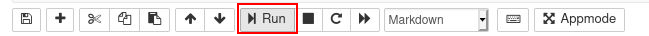
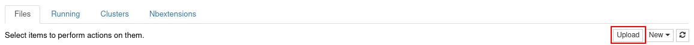
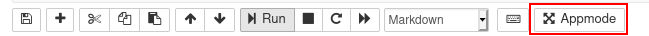

# BiCEP GUI Readme

## Information

- BiCEP GUI is a graphical user interface for the BiCEP method of estimation paleointensity (Cych et al, in prep) using jupyter, ipywidgets, and voila. On the backend, BiCEP uses the python version of stan (pystan).

- Planned features include: Changing orientation of Zijderveld plot, ability to save figures separately.

## Setup - jupyterhub

- To use BiCEP GUI, we recommend using the Earthref jupyterhub at http://jupyterhub.earthref.org. To run the GUI from this site, first run the Bicep-GUI-Setup notebook by clicking on this and pressing the run button until you reach the end of the notebook. Note that this setup may take several minutes.

- You will then have a directory called BiCEP_GUI in your jupyterhub. Navigate to this.

- Before using BiCEP GUI on your own data, you will need to upload MagIC formatted files containing your paleointensity data. You create these files using pmag_gui, part of the PmagPy package. For help with this, see the tutorial at https://github.com/ltauxe/PmagPy_tutorials

- Upload your measurements.txt, specimens.txt, samples.txt and sites.txt files to the BiCEP_GUI directory using the upload button in jupyterhub.

- If you encounter any problems using the jupyterhub site, try pressing "Control Panel" in the top right and "Stop My Server". You will then be offered the opportunity to restart your jupyterhub server.

## Setup - local machine

- To use BiCEP GUI on a local machine, you will need Anaconda python. Follow the install instructions at https://docs.anaconda.com/anaconda/install/

- Using the command line, navigate to the directory you want your BiCEP GUI folder to be in and clone using the command `git clone https://github.com/bcych/BiCEP_GUI`

- Install PmagPy (follow instructions at https://earthref.org/PmagPy/cookbook/#x1-20001)

- You need to install a C++ 14 compatible compiler (gcc or clang) to compile the models for BiCEP GUI to work. This is done for you in the Mac OS environment. On Linux and Windows, follow installation instructions for gcc.

- In Mac OS, using the terminal, navigate to the newly created BiCEP_GUI directory and install the required python packages using the command `conda env create -f environment_osx.yml`. In Linux or Windows, use the command `conda env create -f environment.yml`. If using windows, you will have to execute this command in the Anaconda prompt program rather than the default command prompt. This creates a controlled environment with the python packages you need to run BiCEP which will not mess up your other installed packages.

- In the same console as before, type `conda activate BiCEP` to activate your BiCEP environment with all your packages pre installed. You will need to use this command every time you run BiCEP GUI. 

- Run the "compile_models.py" python script. This compiles the pystan models as C++ code on your system. Note that if you are on Mac OS Catalina, this may not work if you are using bash as your shell, either switch to zsh or use the jupyterhub method. You only need to perform this step once.

- As an alternative to the previous two steps, you can install and compile the models by uncommenting and running the first cell in the notebook.

- To access the BiCEP GUI notebook, type `jupyter notebook` in the console.

- Before using BiCEP GUI on your own data, you will need to upload MagIC formatted files containing your paleointensity data. You create these files using pmag_gui, part of the PmagPy package. For help with this, see the tutorial at https://github.com/ltauxe/PmagPy_tutorials

- Copy and paste your measurements.txt, specimens.txt, samples.txt and sites.txt files into the BiCEP_GUI directory.

## Alternative pip install

- If you don't want to install into a special anaconda environment, you can also perform a pip install using the command `pip install -r requirements.txt`. Note that this is less version controlled than the anaconda environment and may break other packages you have installed. 

## Using BiCEP GUI

- Open the BiCEP GUI notebook in your folder. Press the "Appmode" button (or "Voila" button, located in the same place, if running on your own machine) to launch the GUI.

- Your MagIC data will automatically be converted to the BiCEP format. A logfile will be output to thellier_convert.log which you can check for errors.

- On launch you should have a GUI with the following layout:

On launch you should have a GUI with the above layout:

1. File selection button. Press select, choose your file, and press select again. Then press "Run" to import the data to the GUI. You cannot then select a new file.

2. Site and specimen dropdowns. These dropdown menus allow you choose a particular paleointensity experiment.

3. Minimum and maximum temperature steps (in Celcius) to use for the paleointensity experiment. We recommend using the Zijderveld plot (6.) and pTRM checks to choose which set of temperatures to use. By default, we use all temperature steps to make a paleointensity estimate. Currently it is required to make an estimate for all specimens.

4. Statistics about the direction and alteration of the ChRM used for paleointensity estimation. These may help with choosing which set of temperature steps to use. See the standard paleointensity definitons (Paterson et al, 2014, https://earthref.org/PmagPy/SPD/DL/SPD_v1.1.pdf) for more information on these statistics. In addition to these statistics, we present the worst R_hat diagnostic for a specimen. If R_hat>1.1 or R_hat<0.9, it may indicate an issue with the sampler (see 13.). In this case, this box will show up as red, and the specimen may be excluded using the checkbox (8.))

4. Arai plot with zero field first steps plotted as red circles, in field first steps plotted as blue circles, pTRM checks plotted as triangles, and pTRM tail checks plotted as squares. Additivity checks are not currently plotted. Circle fits from the BiCEP method will be plotted as green lines under the Arai plot after the site fit (9) has been performed. All plots can be rescaled using the "move" button (3rd symbol from the bottom on left side of plot) and right clicking and dragging, or the "zoom" button (2nd symbol from the bottom) and left clicking and dragging to zoom in, or right clicking and dragging to zoom out. The "home" button (second symbol from the top) resets the plot axis, as does changing the temperatures.

5. Zijderveld plot of the data, with x,y plotted as black circles and x,z plotted as red squares.

7. Saves the temperatures used for that specimen to RAM. This must be done for each specimen individually to change temperatures before running the sampler (9.). By default, all temperature steps are used for every specimen.

8. Checkbox for excluding a specimen. This should only be done if there is no reasonable interpretation of the specimen (e.g. alteration at low temperature, not demagnetizing to the origin).

9. The "Process Site Data" button performs the BiCEP method on that site and calculates the site level paleointensity. Depending on the speed of your computer and the sampler parameters used (10), this may take a while to run, especially for sites with many specimens. Please be patient.

10. Parameters for the MCMC sampler for the BiCEP method. The "n samples" slider increases the number of samples used in the MCMC sampler. Smaller numbers will take less time to run but result in lower accuracy in the resulting probability distribution. The "Sampler" button changes the parameterization of the MCMC sampler slightly (mathematically, the model is the same, but the parameters being sampled from are specified slightly differently). The "Slow, more accurate" sampler is much slower than the "Fast, less accurate" sampler, but generally (though not always) results in better sampler diagnostics than the "Fast, less accurate" sampler, particularly for sites with small numbers of specimens.

11. Plot of the estimated paleointensity for each specimen against Arai plot curvature. The currently displayed specimen in the Arai and Zijderveld plots has a red circle around it in this plot. The blue lines are samples from the posterior distribution for the relationship between specimen level paleointensity and curvature. The y intercept is the estimated site level paleointensity.

12. Histogram of the site level paleointensities sampled from the posterior distribution. This corresponds to the distribution of intercepts of the blue lines in (11.).

13. Diagnostics for the MCMC sampler (see Cych et al, in prep. or the Stan Documentation at https://mc-stan.org/docs/2_26/reference-manual/notation-for-samples-chains-and-draws.html, https://mc-stan.org/docs/2_26/reference-manual/effective-sample-size-section.html). 0.9<R_hat<1.1 and n_eff>1000 is desired, with R_hat=1.00 and n_eff>10000 being ideal. Tweak the sampler parameters (10.) or measure more specimens if these parameters give poor results (indicated by an amber color for n_eff<1000 or a red color for bad R_hat). Also displayed here is the 95% credible interval for the site and the Category (see Cych et al once again for an explanation). The color of the category box indicates how to proceed. Green (Category A or B): accept site, Amber (Category C or D): measure more specimens, Red (Category D): ignore site.

14. Saves figures to file. Currently the Zijderveld plot and Arai plot have to be saved together (as do both site plots).

15. Saves the results from the BiCEP method to the MagIC tables (site and specimen tables are altered).

## Interoperability with redo files for choosing temperatures on the Arai plot

BiCEP GUI offers interoperability with the redo file format used by Thellier GUI (Shaar and Tauxe, 2013). BiCEP_GUI saves specimen interpretations to a bicep_gui.redo file which can be used by Thellier GUI. Equally, specimens intepretations generated by the Thellier GUI auto intepreter can be used by BiCEP GUI by making a copy of the thellier_gui.redo file called bicep_gui.redo .

## Attributions

Paterson, G. A., L. Tauxe, A. J. Biggin, R. Shaar, and L. C. Jonestrask (2014), On improving the selection of Thellier-type paleointensity data, Geochem. Geophys. Geosyst., doi: 10.1002/2013GC005135

Shaar, R., and Tauxe, L. (2013), Thellier GUI: An integrated tool for analyzing paleointensity data from Thellier-type experiments, Geochem. Geophys. Geosyst., 14, 677– 692, doi:10.1002/ggge.20062.

Stan Development Team. 2021. Stan Modeling Language Users Guide and Reference Manual, 2.26. https://mc-stan.org

Tauxe, L., R. Shaar, L. Jonestrask, N. L. Swanson-Hysell, R. Minnett, A. A. P. Koppers, C. G. Constable, N. Jarboe, K. Gaastra, and L. Fairchild (2016), PmagPy: Software package for paleomagnetic data analysis and a bridge to the Magnetics Information Consortium (MagIC) Database, Geochem. Geophys. Geosyst., 17, doi:10.1002/2016GC006307

## Licensing
PmagPy and Stan are licensed under a 3-clause BSD license. See (https://opensource.org/licenses/BSD-3-Clause)

## Contact
If you have any issues with this software, feature requests or want to collaborate, feel free to correspond with me at bcych@ucsd.edu or leave an issue or feature request on the github at http://github.com/bcych/BiCEP_GUI
